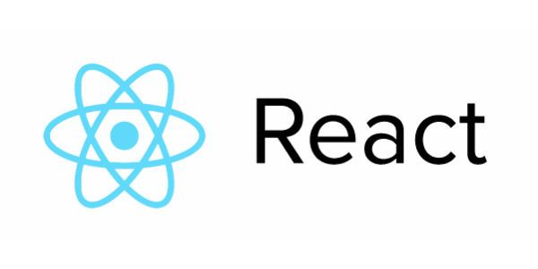

## React.js学习
从Vue框架的学习转到React，发现这是一个书写十分优雅的前端框架。因此，具有对比思维的学习React促使了这个仓库的诞生。学无止境，demo与笔记以及练手项目都会在这里一一说明展示。为以后的知识沉淀做铺垫。



### 从TodoList开始

进入todolist阅读源码并且配合笔记使用更佳，对于最初的React基础使用以及虚拟DOM的了解，到最后的生命周期函数的查看，这里十分清晰明了。

- 进入对应目录
```shell
cd todolis
```
- 安装依赖
```shell
npm install
```
- 运行ReactDemo
```shell
npm run start
```

#### 笔记配合阅读
- [入门：从todolist开始](./book/01.从TodoList开始.md)
- [补充：第一个demo还需要了解这些](./book/02.todolist的细节补充.md)
- [理解：虚拟DOM是什么？](./book/03.虚拟DOM.md)
- [理解：Diff算法是性能飞跃的核心](./book/04.虚拟DOM的Diff算法.md)
- [掌握：生命周期函数](./book/生命周期.md)

### 利用生命周期函数优化demo
既然学习了生命周期函数，并且要求掌握这个核心概念，我们就可以从之前的TodoList中挑刺了，配合注释，我们可以理解为何会有这样的变动，一切都是为了性能的优化。

#### 为何改动

我们通过在父子组件的render函数中打印`render函数执行了`这句话，可以发现，父组件会影响到子组件render函数的执行。即使子组件没有任何变化，但由于父组件render在执行，就使得子组件render执行，这无疑造成了性能的损耗。

- 利用生命周期函数优化性能，如果新的Props变化了（nextProps.content === this.props.content 说明没有变化），就让render函数执行

```javascript
shouldComponentUpdate(nextProps, nextState, nextContext) {
   return nextProps.content !== this.props.content;
}
```

在真实项目中，我们的页面加载时就会发起一些ajax请求，ajax我们写在哪里合适？其实根据生命周期函数，我们为了避免页面变化就反复发起ajax请求，可以将页面加载一开始就发起的请求写进只执行一次的函数中。

```javascript
componentDidMount() {
    // 因为componentDidMount只会执行一次，页面加载时的ajax放在这里保证只发起一次请求即可
    axios.get('./todolist.json')
      .then((res) => {
        this.setState(() => {
          return {
            list: [...res.data]
          }
        })
      })
      .catch(() => {alert('error')})
  }
```

现在我们阅读源码看看优化后的代码吧：进入对应目录，安装依赖，运行ReactDemo

```shell
cd 生命周期的应用demo
npm install
npm run start
```
### React动画的demo

React的动画实现依赖ReactTransition库的实现，具体内容建议结合代码和文档阅读。
#### 你应该读的源码
```shell
cd animation
```

### Redux管理数据与todolist的重构

如果项目变成大型项目，React作为视图层的框架显然不能够更好的处理数据层的内容。因此，我们需要一个抽离出来的模块去管理数据层的内容。Redux应运而生，这里对Redux做了一个详细的描述，并且对我们之前写的代码用Redux进行了重构。

#### 你应该了解的内容：

- [Redux如何理解？](./book/06.Redux的初步了解.md)
- [Redux和AntD组件重构todo，一定要仔细读笔记和源码啦！](./book/07.如何用Redux重构todo.md)

#### 你应该阅读的代码：
```shell
cd todolist_antd
```
